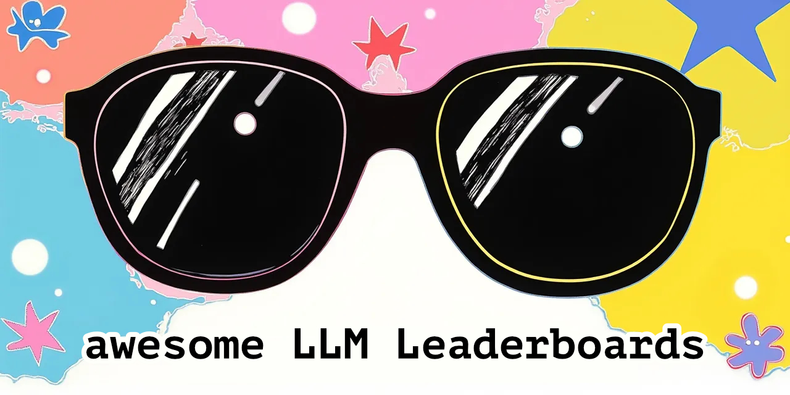

#  🕶️ Awesome LLM Leaderboards 🏆 

A curated list of leaderboards for evaluating Large Language Models (LLMs), organized by category.

 

## Table of Contents
- [General Performance](#general-performance)
- [Conversational AI](#conversational-ai)
- [Specialized Capabilities](#specialized-capabilities)
- [Domain-Specific](#domain-specific)
- [Code Generation](#code-generation)
- [Multilingual & Speech](#multilingual--speech)
- [Multimodal](#multimodal)
- [Technical Performance](#technical-performance)
- [Agent specific](#agent-specific)
- [Mathematical & Financial](#mathematical--financial)

 

## General Performance

| Leaderboard | Description | Update Frequency |
|-------------|-------------|------------------|
| [HuggingFace Open LLM](https://huggingface.co/spaces/HuggingFaceH4/open_llm_leaderboard) | Comprehensive evaluation using ARC, HellaSwag, MMLU, TruthfulQA | Continuous |
| [OpenRouter Rankings](https://openrouter.ai/rankings) | Category-specific performance across domains (Roleplay, Programming, Marketing, Legal, etc.) | Daily |
| [HELM](https://crfm.stanford.edu/helm) | Holistic evaluation across multiple scenarios and tasks | Monthly |
| [OpenCompass](https://opencompass.org.cn/home) | Multiple benchmarks and API evaluation | Monthly |
| [Artificial Analysis](https://artificialanalysis.ai) | Quality, speed, latency, and pricing metrics | Daily |
| [Klu.ai](https://klu.ai/llm-leaderboard) | Comprehensive use case performance evaluation | Monthly |
| [MMLU by Task](https://huggingface.co/spaces/CoreyMorris/MMLU-by-task-Leaderboard) | Detailed MMLU performance breakdown by subject | Monthly |
| [Olympic Arena](https://gair-nlp.github.io/OlympicArena/) | Comprehensive evaluation across disciplines | Monthly |

 

## Conversational AI

| Leaderboard | Description | Update Frequency |
|-------------|-------------|------------------|
| [LMSYS Chatbot Arena](https://chat.lmsys.org) | Human-based evaluation with Elo ratings | Weekly |
| [AlpacaEval](https://tatsu-lab.github.io/alpaca_eval) | Instruction following capability vs GPT-4 | Continuous |
| [EQ-Bench](https://eqbench.com) | Emotional intelligence and social dynamics | Quarterly |

 

## Specialized Capabilities

| Leaderboard | Description | Update Frequency |
|-------------|-------------|------------------|
| [MTEB](https://huggingface.co/spaces/mteb/leaderboard) | Text embedding evaluation across 112 languages | Monthly |
| [Berkeley Function-Calling](https://gorilla.cs.berkeley.edu/leaderboard) | Tool use and function calling capabilities | Monthly |
| [Vectara Hallucination](https://github.com/vectara/hallucination-leaderboard) | Factual consistency and hallucination detection | Monthly |
| [UGI](https://huggingface.co/spaces/DontPlanToEnd/UGI-Leaderboard) | Uncensored general intelligence metrics | Monthly |

 

## Domain-Specific

| Leaderboard | Description | Update Frequency |
|-------------|-------------|------------------|
| [Open Medical LLM](https://huggingface.co/spaces/openlifescienceai/open_medical_llm_leaderboard) | Medical knowledge and reasoning | Monthly |
| [Trustbit LLM](https://trustbit.tech/llm-benchmarks) | Business applications and CRM. (You need to scroll down link for each month) | Monthly |
| [SEAL](https://scale.com/leaderboard) | Safety and alignment evaluation | Monthly |

 

## Code Generation

| Leaderboard | Description | Update Frequency |
|-------------|-------------|------------------|
| [Big Code Models](https://huggingface.co/spaces/bigcode/bigcode-models-leaderboard) | Code generation and completion | Monthly |
| [Aider Coding](https://aider.chat/leaderboard) | Interactive coding assistance | Monthly |
| [Can AI Code](https://huggingface.co/spaces/mike-ravkine/can-ai-code-results) | Code generation evaluation across multiple tasks | Monthly |
| [ProLLM Coding Assistant](https://prollm.toqan.ai/leaderboard/coding-assistant) | Stack Overflow based evaluation, 925 samples across languages | Monthly |

 

## Code Generation

| Leaderboard | Description | Update Frequency |
|-------------|-------------|------------------|
| [Big Code Models](https://huggingface.co/spaces/bigcode/bigcode-models-leaderboard) | Code generation and completion | Monthly |
| [Aider Coding](https://aider.chat/leaderboard) | Interactive coding assistance | Monthly |
| [Can AI Code](https://huggingface.co/spaces/mike-ravkine/can-ai-code-results) | Code generation evaluation across multiple tasks | Monthly |
| [ProLLM Coding Assistant](https://prollm.toqan.ai/leaderboard/coding-assistant) | Stack Overflow based evaluation, 925 samples across languages | Monthly |
| [Text2SQL](https://openlm.ai/text2sql-leaderboard/) | Natural language to SQL query generation | Monthly |

 

## Multilingual & Speech

| Leaderboard | Description | Update Frequency |
|-------------|-------------|------------------|
| [Occiglot Euro LLM](https://huggingface.co/spaces/occiglot/euro-llm-leaderboard) | European language performance | Monthly |
| [Open ASR](https://huggingface.co/spaces/hf-audio/open_asr_leaderboard) | Speech recognition accuracy | Monthly |

 

## Multimodal
| Leaderboard | Description | Update Frequency |
|-------------|-------------|------------------|
| [OpenVLM](https://huggingface.co/spaces/opencompass/open_vlm_leaderboard) | Vision-language model evaluation | Monthly |
| [OpenVLM](https://huggingface.co/spaces/opencompass/open_vlm_leaderboard) | Vision-language model evaluation | Monthly |
| [Vidore](https://huggingface.co/spaces/vidore/vidore-leaderboard) | Video understanding and description | Monthly |
| [Vision Arena](https://huggingface.co/spaces/WildVision/vision-arena) | Side-by-side VLM comparison | Weekly |
| [SEED-Bench](https://huggingface.co/spaces/AILab-CVC/SEED-Bench_Leaderboard) | Comprehensive vision-language tasks | Monthly |
| [MM-UPD](https://huggingface.co/spaces/MM-UPD/MM-UPD_Leaderboard) | Multimodal understanding and perception | Monthly |

 

## Technical Performance

| Leaderboard | Description | Update Frequency |
|-------------|-------------|------------------|
| [LLM-Perf](https://huggingface.co/spaces/optimum/llm-perf-leaderboard) | Hardware performance metrics | Weekly |
| [Artificial Analysis Performance](https://huggingface.co/spaces/ArtificialAnalysis/LLM-Performance-Leaderboard) | Latency, throughput, and cost metrics across different providers | Daily |

 

## Agent specific

| Leaderboard | Description | Update Frequency |
|-------------|-------------|------------------|
| [X-WebArena-Leaderboard](https://docs.google.com/spreadsheets/d/1M801lEpBbKSNwP-vDBkC_pF7LdyGU1f_ufZb_NWNBZQ/edit?gid=2044883967#gid=2044883967) | Agents Web navigation and interaction evaluation | Monthly |

 

## Mathematical & Financial

| Leaderboard | Description | Update Frequency |
|-------------|-------------|------------------|
| [WE-MATH](https://we-math.github.io/#leaderboard) | World knowledge enhanced mathematical reasoning | Monthly |
| [TAT-QA](https://nextplusplus.github.io/TAT-QA/) | Tabular and textual QA with numerical reasoning | Monthly |

 

## Contributing

Feel free to open a pull request to add new leaderboards or update existing ones. Please ensure the leaderboard is actively maintained and provides valuable insights into LLM performance.
